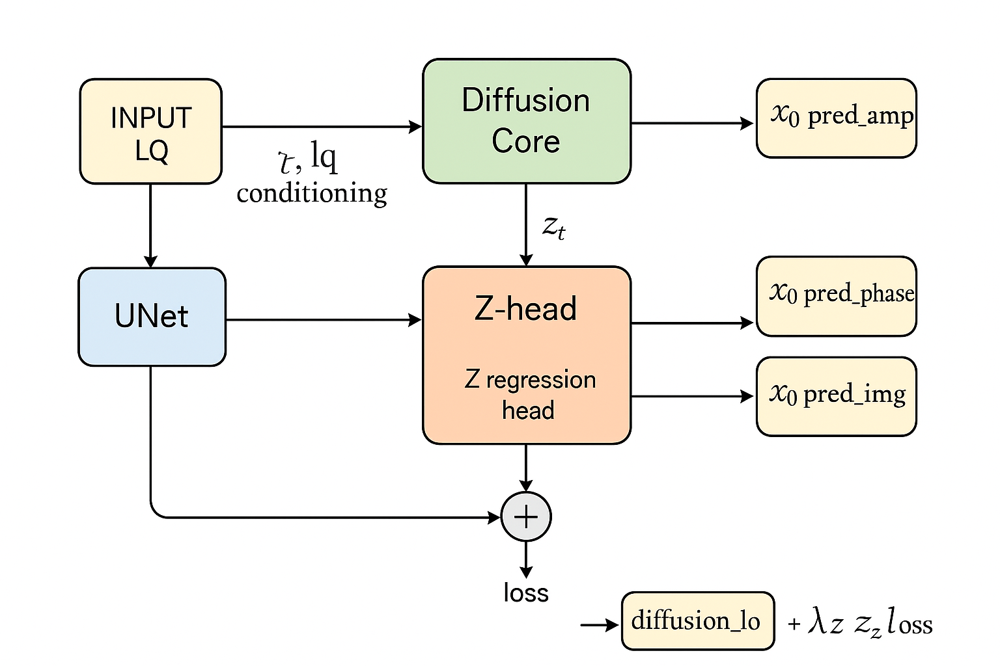

# System Architecture Explanation

The architecture shown above represents an extended **Diffusion-based Hologram Reconstruction Model** augmented with a **Z-Depth Regression Head**.  
The system jointly reconstructs the clean complex hologram \(x_0\) and estimates the physical propagation distance \(Z\).

---

## 1. Input Stage — Hologram Conditioning

**Inputs:**

- **LQ (Low-quality hologram):** complex-valued input (real + imaginary) generated via Fresnel propagation.  
- **Optional:** masks, frequency-domain channels, etc.

The LQ hologram conditions the diffusion model and is also used as input to the shared UNet backbone.

---

## 2. Diffusion Core (Denoising UNet)

Implements DDPM/DDIM-style denoising.

**Inputs:**  
- Noisy latent \(z_t\)  
- Timestep \(t\)  
- Conditioning inputs (LQ, mask…)  
- (Optional) autoencoder latent space

**Outputs:**  
- Predicted clean latent / image \(x_0\)  
- Intermediate latent \(z_t\)

**Diffusion loss:**

$$
L_{\text{diff}} = \mathbb{E}_{t, \epsilon} \Big[ \| \epsilon - \epsilon_{\theta}(z_t, t, \mathrm{LQ}) \|_2^2 \Big]
$$

---

## 3. Z-Regression Head

A lightweight head attached to the UNet’s final feature map.

Predicts the propagation distance:

$$
\hat{Z} \in \mathbb{R}^{B \times 1}
$$

**Z regression loss:**

$$
L_Z = \| \hat{Z} - Z_{\text{true}} \|_2^2
$$

---

## 4. Joint Training Loss

Both losses computed together:

$$
L_{\text{total}} = L_{\text{diff}} + \lambda_Z \cdot L_Z
$$

This ensures physical consistency between hologram reconstruction and depth estimation.

---

## 5. Logged Visualizations

For each selected sample, the trainer logs:

- **Amplitude:**  
  $$
  A(u) = |u|
  $$

- **Phase:**  
  $$
  \phi(u) = \mathrm{angle}(u)
  $$

- **Real-part visualization (normalized):**  
  $$
  I_{\text{display}}(u) = \frac{\operatorname{Re}(u) - \min(\operatorname{Re}(u))}{\max(\operatorname{Re}(u)) - \min(\operatorname{Re}(u)) + \varepsilon}
  $$

The trainer logs these for  
**LQ**, **GT**, **Diffused**, and **x0-pred**.

A footer on each image includes:

- Z_true
- Z_pred
- Mean intensities of original vs reconstructed amplitude  

---

## 6. Summary

This model is a **physics-informed diffusion system** that:

- Reconstructs a clean hologram \(x_0\)  
- Predicts physical depth \(Z\)  
- Uses shared UNet features for both tasks  
- Ensures consistency through joint training  
- Logs amplitude/phase/real outputs for interpretability  

This combination of generative diffusion modeling with physical hologram constraints yields reconstructions that are not only sharp but **physically meaningful**.

